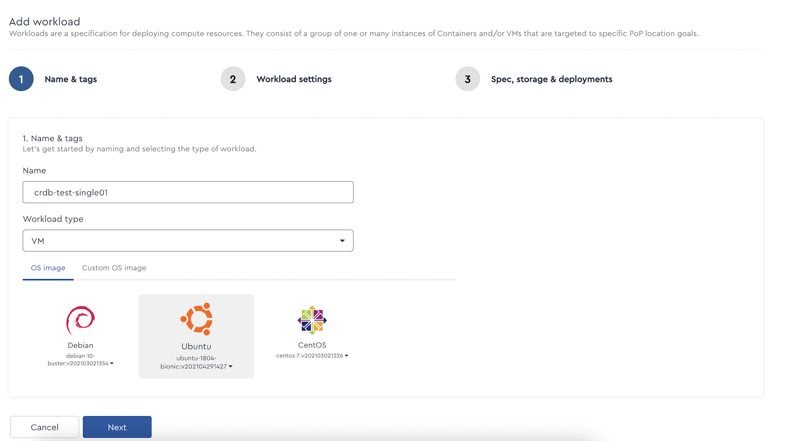
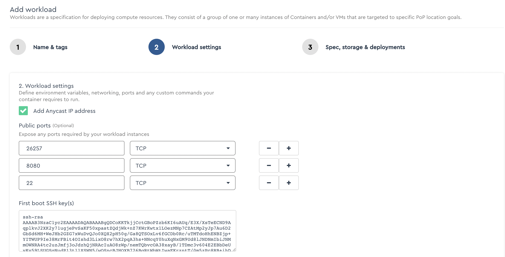
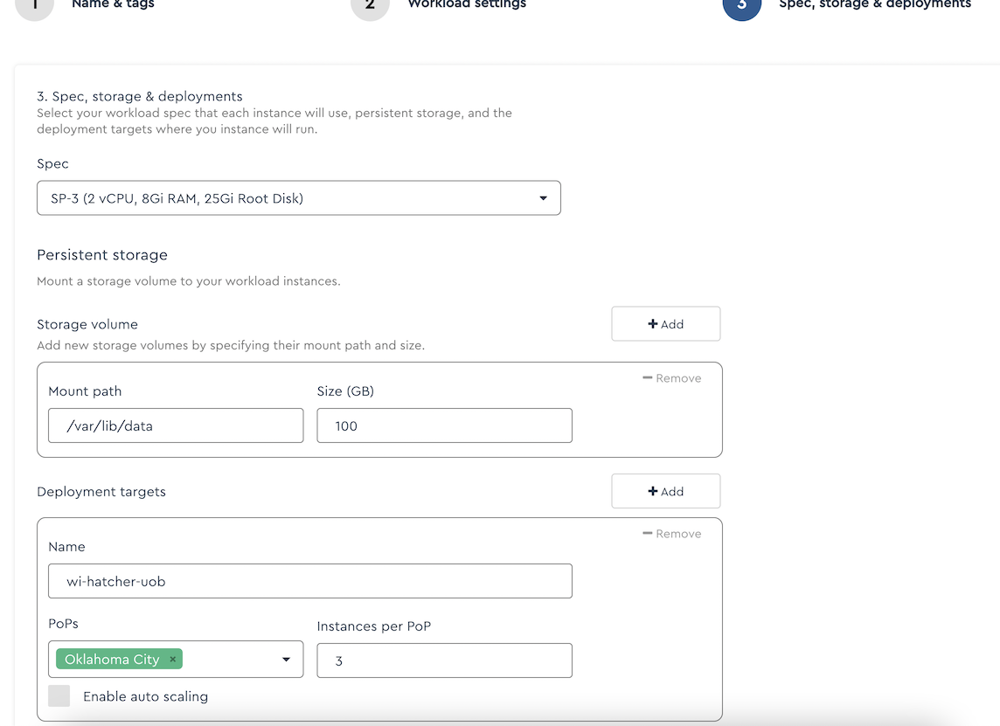
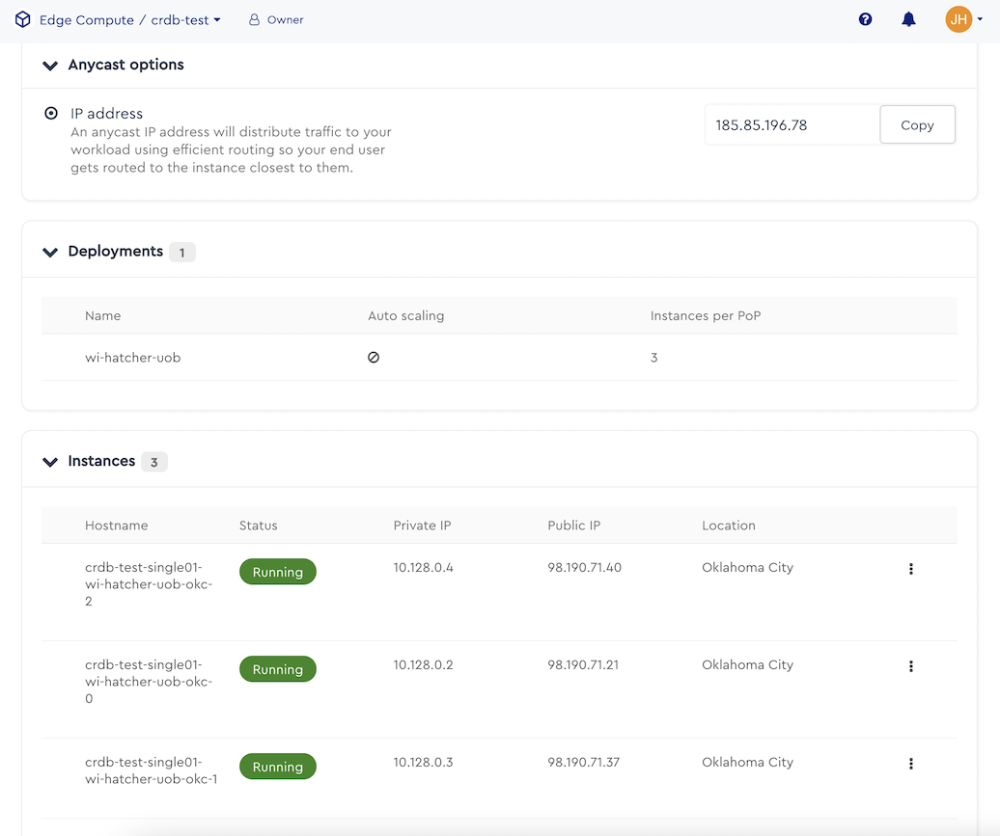

# Cox Edge
Repository of information to use CockroachDB within Cox Edge.

## Run CockroachDB in a single region in Cox Edge
1. In the Cox Edge portal, create an environment.  I called mine crdb-test.

2. Go to the Edge Compute menu.  Create a new workload.  I'm using a name of "crdb-test-single01", a workload type of "VM," and I'm using Ubuntu. 

 
3. Choose to use an Anycast IP address.  Expose ports 26257 (SQL), 8080 (DB Console Web UI), and 22 (SSH).  Inclue your ssh public key.
 
 
4. Choose a Spec of SP-3.  You can choose other sizes, but CockroachDB recommends a 1vCPU:4GB ratio, so pick an Spec that fits this ratio.  Add a persistent storage volume.  Cockroach recommends a maximum of 150TB per vCPU.  For this small demo, I chose to use a 100GB volume.  Choose a single PoP (point of presence) and use a minimum of 3 nodes (since CockroachDB has a default replication factor of 3).
 

5.  Complete the process and wait briefly for the resources to be provisioned.  When the resources, are ready, you will see them in a Running state, with their private/public IPs and host names listed.
  
 
6. Open a command prompt on your local machine (I'm running on a Mac, so this is Linux).  Capture the necessary information from the screen and plug that into the environment variables below. 

		ANYCAST_IP=185.85.196.78
		NODE0_PUBLIC_IP=98.190.71.21
		NODE0_PRIVATE_IP=10.128.0.2
		NODE0_HOSTNAME=crdb-test-single01-wi-hatcher-uob-okc-0
		NODE1_PUBLIC_IP=98.190.71.37
		NODE1_PRIVATE_IP=10.128.0.3
		NODE1_HOSTNAME=crdb-test-single01-wi-hatcher-uob-okc-1
		NODE2_PUBLIC_IP=98.190.71.40
		NODE2_PRIVATE_IP=10.128.0.4
		NODE2_HOSTNAME=crdb-test-single01-wi-hatcher-uob-okc-2

      Run these statements to establish the env vars in your session.

7. SSH into each node and run the following setup commands:

		ssh ubuntu@$NODE0_PUBLIC_IP
		ssh ubuntu@$NODE1_PUBLIC_IP
		ssh ubuntu@$NODE2_PUBLIC_IP
		
		**********************************
		** Do this on each remote machine
		**********************************
		
		mkdir /home/ubuntu/certs
		curl https://binaries.cockroachdb.com/cockroach-v22.1.7.linux-amd64.tgz | tar -xz
		sudo cp -i cockroach-v22.1.7.linux-amd64/cockroach /usr/local/bin/
		sudo mkdir -p /usr/local/lib/cockroach
		sudo cp -i cockroach-v22.1.7.linux-amd64/lib/libgeos.so /usr/local/lib/cockroach/
		sudo cp -i cockroach-v22.1.7.linux-amd64/lib/libgeos_c.so /usr/local/lib/cockroach/
		sudo mkdir -p /var/lib/data/cockroach-data
		sudo chown ubuntu:ubuntu /var/lib/data/cockroach-data/
		sudo mkdir -p /var/lib/data/cockroach-certs

      Notice that I'm pulling down the CockroachDB executable for version 22.1.7 here.  You can determine the latest version by looking at the [CockroachDB releases page](https://www.cockroachlabs.com/docs/releases/index.html).

8. On your local machine, download the cockroach executable.  You'll need it to generate certificates.  You can grab the latest [here](https://www.cockroachlabs.com/docs/stable/install-cockroachdb-mac.html).

      Create a directory to work in and change into that directory.

		mkdir certs my-safe-directory
		
		cockroach cert create-ca --certs-dir=certs --ca-key=my-safe-directory/ca.key
		
		cockroach cert create-client root --certs-dir=certs --ca-key=my-safe-directory/ca.key
		
		cockroach cert create-node \
		$NODE0_PRIVATE_IP \
		$NODE0_PUBLIC_IP \
		$NODE0_HOSTNAME \
		localhost \
		127.0.0.1 \
		$ANYCAST_IP \
		--certs-dir=certs \
		--ca-key=my-safe-directory/ca.key
		
		scp certs/ca.crt certs/node.crt certs/node.key certs/client.root.crt certs/client.root.key ubuntu@$NODE0_PUBLIC_IP:~/certs
		
		#you want to do this after you've copied the node cert so that you won't get an error saying that node.cert and node.key already exist
		mv certs/node.crt certs/node.crt.node0
		mv certs/node.key certs/node.key.node0
		
		cockroach cert create-node \
		$NODE1_PRIVATE_IP \
		$NODE1_PUBLIC_IP \
		$NODE1_HOSTNAME \
		localhost \
		127.0.0.1 \
		$ANYCAST_IP \
		--certs-dir=certs \
		--ca-key=my-safe-directory/ca.key
		
		
		scp certs/ca.crt certs/node.crt certs/node.key certs/client.root.crt certs/client.root.key ubuntu@$NODE1_PUBLIC_IP:~/certs
		
		#you want to do this after you've copied the node cert so that you won't get an error saying that node.cert and node.key already exist
		mv certs/node.crt certs/node.crt.node1
		mv certs/node.key certs/node.key.node1
		
		cockroach cert create-node \
		$NODE2_PRIVATE_IP \
		$NODE2_PUBLIC_IP \
		$NODE2_HOSTNAME \
		localhost \
		127.0.0.1 \
		$ANYCAST_IP \
		--certs-dir=certs \
		--ca-key=my-safe-directory/ca.key
		
		scp certs/ca.crt certs/node.crt certs/node.key certs/client.root.crt certs/client.root.key ubuntu@$NODE2_PUBLIC_IP:~/certs
		
		#you want to do this after you've copied the node cert so that you won't get an error saying that node.cert and node.key already exist
		mv certs/node.crt certs/node.crt.node2
		mv certs/node.key certs/node.key.node2

9. Now, on each node, ssh in and do a few more things now that the certs are in place.  Run the appropriate start command for the node that you're on (0, 1, or 2) -- just run one start command per node!

		ssh ubuntu@$NODE0_PUBLIC_IP
		ssh ubuntu@$NODE1_PUBLIC_IP
		ssh ubuntu@$NODE2_PUBLIC_IP
		
		**********************************
		** Do this on each remote machine
		**********************************

		sudo cp ~/certs/* /var/lib/data/cockroach-certs/
		sudo chown ubuntu:ubuntu /var/lib/data/cockroach-certs/*
		
		ANYCAST_IP=185.85.196.78
		NODE0_PUBLIC_IP=98.190.71.21
		NODE0_PRIVATE_IP=10.128.0.2
		NODE0_HOSTNAME=crdb-test-single01-wi-hatcher-uob-okc-0
		NODE1_PUBLIC_IP=98.190.71.37
		NODE1_PRIVATE_IP=10.128.0.3
		NODE1_HOSTNAME=crdb-test-single01-wi-hatcher-uob-okc-1
		NODE2_PUBLIC_IP=98.190.71.40
		NODE2_PRIVATE_IP=10.128.0.4
		NODE2_HOSTNAME=crdb-test-single01-wi-hatcher-uob-okc-2
		
		
		cockroach start \
		--certs-dir=/var/lib/data/cockroach-certs/ \
		--advertise-addr=$NODE0_PUBLIC_IP \
		--join=$NODE0_PUBLIC_IP,$NODE1_PUBLIC_IP,$NODE2_PUBLIC_IP \
		--store=/var/lib/data/cockroach-data \
		--cache=.25 \
		--max-sql-memory=.25 \
		--background
		
		cockroach start \
		--certs-dir=/var/lib/data/cockroach-certs/ \
		--advertise-addr=$NODE1_PUBLIC_IP \
		--join=$NODE0_PUBLIC_IP,$NODE1_PUBLIC_IP,$NODE2_PUBLIC_IP \
		--store=/var/lib/data/cockroach-data \
		--cache=.25 \
		--max-sql-memory=.25 \
		--background
		
		cockroach start \
		--certs-dir=/var/lib/data/cockroach-certs/ \
		--advertise-addr=$NODE2_PUBLIC_IP \
		--join=$NODE0_PUBLIC_IP,$NODE1_PUBLIC_IP,$NODE2_PUBLIC_IP \
		--store=/var/lib/data/cockroach-data \
		--cache=.25 \
		--max-sql-memory=.25 \
		--background

      I'm not specifying a `--locality` on these start commands since they're all in the same PoP, but if you plan on expanding to a multi-region cluster later, you might want to specify a locality like `--locality=region=okc`

10.  Once you have started each node, you should be able to see that various files were created in the data directory, and there should be some messages getting logged to the cockroach.log file.

        ls -alh /var/lib/data/cockroach-data/
        tail -f /var/lib/data/cockroach-data/logs/cockroach.log

      The log messages should indicate that the nodes have found each other and are waiting to be initialized.

11. Back on your local machine, run the following command to init the cluster.

		cockroach init --certs-dir=certs --host=$ANYCAST_IP

      Once this completes, the cluster should be running.  You can log into the cluster now to verify it's running by executing the following command:
      
		cockroach sql --certs-dir=certs --host=$ANYCAST_IP

      If you get into the SQL shell OK, run the following two SQL statements to create a user and grant it admin rights:

		CREATE USER roach WITH PASSWORD 'roach';
		GRANT ADMIN TO roach;

      Now, you can try to access the DB Console by going to a browser and navigating to `https:{anycast IP}:8080`.  You will need to accept the SSL warning since we're using a self-signed certificate.  Log in using the username/password created above.

12. Now that the cluster is started and we can access it via SQL and via the DB Console, let's kick off a workload so that we can see some traffic going against the DB.

		cockroach workload init tpcc 'postgresql://root@'$ANYCAST_IP':26257/tpcc?sslmode=verify-full&sslrootcert=certs/ca.crt&sslcert=certs/client.root.crt&sslkey=certs/client.root.key'
		
		cockroach workload run tpcc --duration=10m 'postgresql://root@'$ANYCAST_IP':26257/tpcc?sslmode=verify-full&sslrootcert=certs/ca.crt&sslcert=certs/client.root.crt&sslkey=certs/client.root.key'

13. If you want to connect to the CRDB cluster running in Cox Edge from an app server running in Cox Edge (which should make the network roundtrip much smaller), you can start a separate workload using the same steps as above -- but don't use an Anycast IP and just create 1 node.

      On that node, you'll want to download the cockroach executable and create a folder for certs.
      
		mkdir /home/ubuntu/certs
		curl https://binaries.cockroachdb.com/cockroach-v22.1.7.linux-amd64.tgz | tar -xz
		sudo cp -i cockroach-v22.1.7.linux-amd64/cockroach /usr/local/bin/
		sudo mkdir -p /usr/local/lib/cockroach
		sudo cp -i cockroach-v22.1.7.linux-amd64/lib/libgeos.so /usr/local/lib/cockroach/
		sudo cp -i cockroach-v22.1.7.linux-amd64/lib/libgeos_c.so /usr/local/lib/cockroach/
		sudo mkdir -p /var/lib/data/cockroach-certs

       Then, from your local machine, you'll want to copy the ca.crt and the root user public/private keypair to the app machine.  (Don't forget to substitute the right public IP address.)
       
		scp certs/ca.crt certs/client.root.crt certs/client.root.key ubuntu@{public IP of app node}:~/certs
		
      Then, back on the app node, copy the certs to the right place:
      
		sudo cp ~/certs/* /var/lib/data/cockroach-certs/
		sudo chown ubuntu:ubuntu /var/lib/data/cockroach-certs/*
		
      Now, you can run queries and workloads from this server inside of Cox edge.
      
		cockroach sql --host {anycast IP} --certs-dir /var/lib/data/cockroach-certs/
